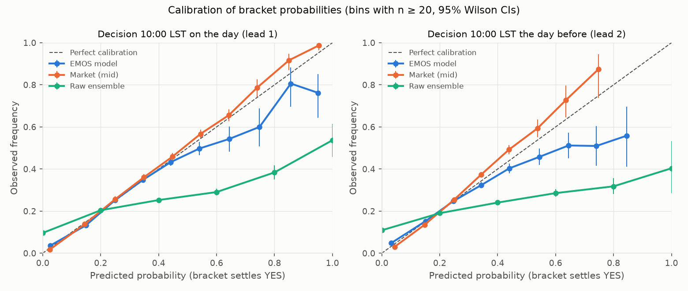
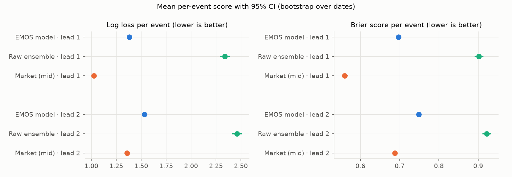
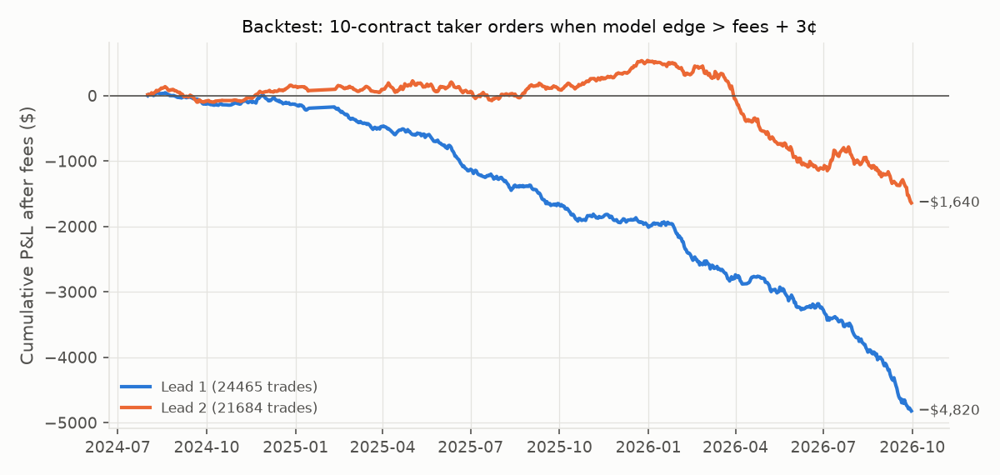

# kalshi-weather-edge

**Calibrated fair values for Kalshi's daily high-temperature markets. EMOS cuts forecast error by 31% versus the raw weather models, but over 7,658 settled events Kalshi's own prices were better calibrated still (log loss 1.03 vs 1.38), and a fee-aware backtest of trading the disagreements loses money (−6.0% ROI, 95% CI −7.4% to −4.7%).**

That negative result is the point of the project: an end-to-end, leak-free pipeline that measures how good a forecast-driven fair value really is against a live prediction market, with confidence intervals instead of a cherry-picked equity curve.



| | |
|---|---|
|  |  |

## Run it (three commands)

```bash
python3 -m venv .venv && source .venv/bin/activate && pip install -r requirements.txt && pip install -e .
weather-edge collect weather markets quotes   # first run ~3-4 h (Kalshi rate limits), then incremental
weather-edge evaluate                         # walk-forward EMOS, scores vs market, backtest -> reports/
```

Other commands: `weather-edge markets` (live quotes, partition check), `weather-edge fit`
(refit the frozen models in `models/`), `weather-edge daily` (forward-test snapshot, used by CI),
`weather-edge paper` (demo-exchange paper trading; needs keys, see below), `pytest`, `ruff check .`.

## What's here

```
src/weather_edge/
  stations.py          24 Kalshi series -> NWS CLI site, ASOS id, coordinates, standard-time offset
  kalshi/              read-only client (pagination, 429 back-off, live/historical routing),
                       bracket parsing, RSA-PSS request signing
  weather/             CLI-day windows + leak-free decision times, Open-Meteo forecasts, NWS CLI obs
  model/               bracket probabilities, Gaussian EMOS (CRPS fit, walk-forward)
  evaluation/          proper scores, date-clustered bootstrap, backtest, figures, RESULTS.md
  trading/             fees, fractional Kelly + caps, demo-only client, paper trader, kill switch
  live.py / daily.py   frozen-model fair values; daily forward-test job
tests/                 unit tests for the model math, fees/sizing, look-ahead, order mapping, safety
reports/               results.json, RESULTS.md, figures, trade logs (generated)
live/                  forward-test snapshots + ensemble archive (written daily by GitHub Actions)
models/                frozen EMOS parameters used by the live/forward-test code
```

## Methodology

### Markets and settlement
Kalshi runs 24 daily high-temperature series (`KXHIGHNY`, `KXHIGHCHI`, …; all listed in
[`stations.py`](src/weather_edge/stations.py)). Each city-day event has six brackets: four
2°F-wide ranges and two open tails. Every series' rules name an NWS Daily Climate Report (CLI)
site, which fixes the station: `CLINYC` is Central Park, `CLIMDW` is Chicago **Midway** (not
O'Hare), `CLIHOU` is Houston **Hobby**, `CLIMSY` is New Orleans airport, and so on.
Coordinates come from `api.weather.gov`.

Two details that are easy to get wrong:

* **Measurement day.** The CLI covers midnight to midnight *local standard time* all year.
  Under daylight saving time that is 1:00 AM to 1:00 AM on the clock. Every window is built in
  UTC with a fixed standard offset, and tests cover it.
* **Settlement source.** In mid-August 2026 the rules changed from the "NWS Climatological
  Report (Daily)" to "The Weather Company" reporting the same CLI site. Kalshi's settled value
  still equals the NWS CLI high in 99.9% of events across both regimes. The one large
  disagreement is Miami on 29 Aug 2026, which TWC reported as 90°F and NWS as 85°F.

**Fees** (Kalshi fee schedule): taker fee = ceil-to-cent(0.07 × C × P × (1−P)) per order. That
peaks at 1.75¢ per contract at 50¢, and the round-up dominates for small orders. Weather series
pay no maker fee and there is no settlement fee.

### Data
| Source | Used for | Coverage |
|---|---|---|
| Kalshi API (`/historical/markets`, `/markets`, candlesticks) | Settled markets, results, hourly bid/ask at each decision time | 2024-03 → today; 7 series since 2024–25, 17 since 2026 |
| Open-Meteo Previous Runs API | Fixed-lead (24 h / 48 h) forecasts from GFS, ECMWF IFS, ICON, GEM, JMA | 2024-03 → today |
| Open-Meteo Single Runs API | Decision-day 00Z ECMWF HRES run (ablation) | 2024-03 → today, 4 cities |
| Open-Meteo Ensemble API | GEFS (31) + ECMWF ENS (51) members, archived daily from 2026-10-01 | forward only |
| NWS CLI via Iowa Environmental Mesonet | Observed daily highs (training target) | 2024-03 → today |

### Decision times and look-ahead
Two decision times are fixed in advance: **10:00 local standard time on the event day (lead 1)**
and **10:00 the day before (lead 2)**.

* Forecast inputs come from fixed-lead archives. A lead-L value for hour t comes from a run
  initialised at least 24·L hours before t, so the newest run that can feed day D was
  initialised by 00:00 LST on D−(L−1). That is at least 10 h before the decision, against
  roughly 6 h for publication. A test checks this for every station and lead.
* EMOS is refit every month on observations that were final at that month's first decision.
  A test corrupts future observations and confirms that past predictions don't change.
* Market quotes are the last hourly candle that closed at or before the decision time. Events
  whose quote is more than 3 h old, missing or one-sided are excluded and counted.

### Model
1. **Raw ensemble.** The CLI-day maximum from each of the five models, rounded like the CLI.
   Bracket probability is the share of models that land in the bracket.
2. **EMOS** (Gneiting et al., 2005). The forecast is Gaussian, N(μ, σ²), with
   - μ = a + Σ bₖ·xₖ + seasonal sin/cos terms (one weight per model, so the members are not
     treated as interchangeable), and
   - log σ = c₀ + c₁·log(model spread + 0.5) + seasonal terms.

   Parameters minimise the closed-form CRPS. The fit is per station and per lead, with an
   expanding window refit monthly. This is the walk-forward setup that produces every
   evaluated forecast.
3. **Brackets.** The CLI reports integers, so P([lo, hi]) = Φ((hi+0.5−μ)/σ) − Φ((lo−0.5−μ)/σ).
   Neighbouring brackets share edges, so the probabilities sum to exactly 1, which is tested
   on random partitions.

### Evaluation
* **Forecast skill** against observed highs: CRPS, MAE and PIT histograms.
* **Model vs market** on identical events, per event (one categorical forecast over six
  brackets): multi-category Brier score, log loss and ranked probability score. The market's
  probability is the normalised mid-price; raw mids sum to about 1.04–1.06. Calibration uses
  reliability diagrams with Wilson intervals.
* **Confidence intervals** come from a bootstrap that resamples whole **dates**, because
  brackets within an event are mutually exclusive and cities on the same day share weather.
  Differences are paired per event.
* **Backtest.** Buy YES at the ask if p − ask − fee > margin, or buy NO at 1 − bid if
  (1−p) − (1−bid) − fee > margin. Each signal is 10 contracts, held to settlement, so the
  spread and fees are charged in full. The 3¢ margin was fixed in advance; other margins appear
  only as a sensitivity table.
* **Ablation.** The model is refit with the decision-day 00Z ECMWF HRES run as a sixth member.
  That run is the freshest model information public at the decision time, and the comparison
  uses identical rows.

## Results

Full tables, including per-city results and margin sensitivity, are in
[`reports/RESULTS.md`](reports/RESULTS.md). That file is generated from
[`reports/results.json`](reports/results.json). Every number below comes from it, with 95% CIs.

All results are out of sample. EMOS is refit monthly on past data only, and evaluation runs
from Aug 2024 to Sep 2026.

**Forecast skill** (24 stations, about 18,800 station-days per lead):

| | Lead 1 (on the day) | Lead 2 (day before) |
|---|---|---|
| CRPS, EMOS vs raw multi-model Gaussian (°F) | **1.26** vs 1.82 | **1.49** vs 2.00 |
| MAE of the mean (°F) | **1.73** vs 2.51 | **2.04** vs 2.74 |
| 80% interval coverage (target 80%) | 76.7% vs 63.7% | 76.7% vs 63.4% |

**Probabilities vs the market.** Scores are per event, so lower is better:

| | Lead 1 · 7,658 events | Lead 2 · 7,193 events |
|---|---|---|
| Log loss: EMOS / raw ensemble / market | 1.380 / 2.338 / **1.026** | 1.533 / 2.459 / **1.357** |
| Brier: EMOS / raw ensemble / market | 0.697 / 0.902 / **0.560** | 0.749 / 0.922 / **0.688** |
| Log loss, EMOS − market | +0.354 [+0.335, +0.372] | +0.176 [+0.157, +0.194] |
| Cities where the market is significantly better / EMOS significantly better | 21 / 0 of 24 | 18 / 0 of 24 |

**Backtest.** Each signal is 10 contracts, taker side, held to settlement, with a 3¢ margin
after fees:

| | Lead 1 | Lead 2 |
|---|---|---|
| Trades / days | 24,465 / 755 | 21,684 / 740 |
| Fees paid | $2,413 | $2,306 |
| P&L before fees (spread already paid) | −$2,407 | +$666 |
| P&L | −$4,820 | −$1,640 |
| ROI on capital | −6.0% [−7.4%, −4.7%] | −1.6% [−3.0%, −0.5%] |

P&L is negative at every margin from 0¢ to 10¢. The only interval that includes zero is lead 2
at 10¢: −1.1% [−3.4%, +1.1%].

**Ablation: add the decision-day 00Z ECMWF run.** This covers NYC, Chicago, Austin and Miami:

| | Lead 1 · 2,595 events | Lead 2 · 2,303 events |
|---|---|---|
| Log loss, fresh − base | −0.019 [−0.029, −0.009] | −0.012 [−0.021, −0.003] |
| Log loss gap to market, before → after | 0.366 → 0.347 | 0.173 → 0.162 |
| Backtest ROI with the fresh model | −3.7% [−6.3%, −1.1%] | +1.9% [−0.1%, +4.1%] |

**Settlement check.** Kalshi's settled value equals the NWS CLI high in 99.88% of 5,950
NWS-era events and 99.91% of 1,108 events settled by The Weather Company.

### What the results say
1. **Post-processing is essential.** Raw model counts are unusable as prices, with log loss
   2.34. They put 0% on outcomes that happen, they're biased cold, and they're far too
   confident: 64% coverage on an 80% interval. EMOS corrects the bias and the spread and cuts
   CRPS by 31%.
2. **The market is better than a good statistical forecast.** At both decision times, Kalshi's
   normalised mid-prices beat EMOS on Brier, log loss and RPS. The market is significantly better
   in 21 of 24 cities on the event day and 18 of 24 the day before. EMOS is significantly better
   in none.
   - The gap is twice as large on the event day (+0.35) as the day before (+0.18). That fits
     where the market's information edge should be largest: on the day, traders can see
     morning observations and the latest runs.
3. **Trading the disagreements is adverse selection.** At entry the model believed it had
   15.4¢ of edge per contract on the event day, and it realised −2.0¢.
   - On the event day the trades lose money even before fees (−$2,407).
   - The day before, they make a small profit before fees (+$666), but fees ($2,306) turn it
     into a loss.
   - Large disagreements with the market mostly measure model error, not market error.
4. **Stale inputs are not the main reason.** Adding the freshest public model run is a
   significant improvement, yet it closes only about 5–7% of the gap. The single positive
   backtest (fresh model, lead 2, +1.9%) has a CI that includes zero. It is one of 12 backtest
   configurations reported, so it is a hypothesis for forward testing, not an edge.
5. **Where the calibration differs.** EMOS's Gaussian tails are too thin, so brackets it puts
   at 60–80% win only about 50–60% of the time. The market looks slightly *under*-confident on
   favourites: brackets priced around 75% at lead 2 won about 87%. That pattern, a possible
   favourite-longshot bias, is worth testing directly, but it isn't established here.

## Paper trading (Kalshi demo exchange only)

`weather-edge paper` trades on `external-api.demo.kalshi.co`, never on production.

* **Host pinning.** The client accepts only Kalshi's documented demo hosts over https. It
  disables redirects and re-checks the URL on every request. Production and lookalike hosts are
  refused, and tests cover this.
* **Requests are signed** with RSA-PSS/SHA-256 (or Ed25519). Keys are read from `.env`.
* **Orders.** Immediate-or-cancel limit orders are sent only when edge > taker fee + margin, and
  only within 2 h of the decision time, the same window the backtest evaluates. Buying NO is
  sent as a V2 YES-ask at 1 − p.
* **Sizing** is ¼-Kelly on the all-in cost, capped per market, per event (brackets are mutually
  exclusive) and in total, and by the displayed size.
* **Kill switch.** It trips on a `logs/paper/KILL` file, `WEATHER_EDGE_KILL=1`, the daily loss
  limit, or N consecutive API errors, counted across restarts. When tripped it cancels resting
  orders and never un-trips itself.
* **Audit log.** Every fair value, decision, order, response, fill, cancel and error is appended
  to `logs/paper/ledger.jsonl`.

**Needs:** a demo account at <https://demo.kalshi.co> and an API key (Account & security → API
Keys). Then:

```bash
cp .env.example .env    # set KALSHI_DEMO_API_KEY_ID and KALSHI_DEMO_PRIVATE_KEY_PATH
weather-edge paper --series KXHIGHNY            # one pass; add --loop to run every 15 min
```

Without keys the command exits with this message. Kalshi notes that demo prices and liquidity
don't reflect production, so this tests the plumbing and risk controls, not alpha. No demo
trades have been run for this README.

## Automation

[`.github/workflows/daily.yml`](.github/workflows/daily.yml) runs at 15:20, 16:20, 17:20 and
18:20 UTC, which is just after 10:00 local standard time in each US zone. Each run it:

1. Applies the frozen models in `models/` to that day's forecasts.
2. Snapshots fair values against live Kalshi quotes, read-only, for events inside their 2 h
   decision window.
3. Archives the GEFS and ECMWF ensemble once a day.
4. Scores snapshot events once they settle.

Compact results are committed to [`live/`](live/). The first scheduled snapshots start on
2026-10-02, so there are no forward-test scores yet.

## Limitations

* **Information disadvantage.** Archived forecasts are fixed-lead, about 12 h staler at the
  afternoon peak than the freshest run. They include no station guidance (MOS/NBM), and on the
  event day no observations. The market has all of these. The ablation measures part of this
  gap.
* **Gaussian tails are too thin.** The EMOS PIT histogram has excess mass at 0 and 1, so the
  model is overconfident when it is sharp. The reliability diagram shows this above about 50%.
* **Five deterministic models, not a true ensemble.** Open-Meteo keeps only about 3 months of
  ensemble history. The daily job now archives ensembles going forward.
* **Execution.** Fills are assumed at the top of book from hourly candles. Historical depth is
  unavailable, so size is kept to 10 contracts. There is no queue modelling or market impact.
* **Coverage and data quirks.**
  - 17 of the 24 series only started trading in 2026, so most market-comparison events come
    from 7 cities.
  - The ablation covers 4 cities, because Single Runs has history for ECMWF only.
  - About 0.4% of ECMWF single runs are missing from the archive.
  - A few IEM CLI entries are preliminary reports rather than final ones (8 of about 7,000
    settlement comparisons differ by 1°F).

## Next steps

1. Fresher and better inputs at decision time: the latest runs, NWS NBM/MOS station guidance,
   and morning observations for same-day markets.
2. Heavier-tailed or mixture EMOS (logistic or Student-t), or quantile regression for brackets.
3. True-ensemble EMOS once the `live/ensemble` archive covers a full season.
4. Combine rather than compete: use the market price as an input and look for systematic
   miscalibration, such as tails or specific cities or seasons.
5. Passive quoting. There is no maker fee on weather series, so liquidity provision around fair
   value is a different and more plausible edge than taking.
6. Run the paper trader on demo for a month and reconcile the ledger with exchange fills.

## Rules followed

No data or results are fabricated. Everything above comes from public Kalshi, Open-Meteo and NWS
data via the code in this repository. Anything that needs keys or more days of data is built,
tested and documented, but not claimed as a result.
